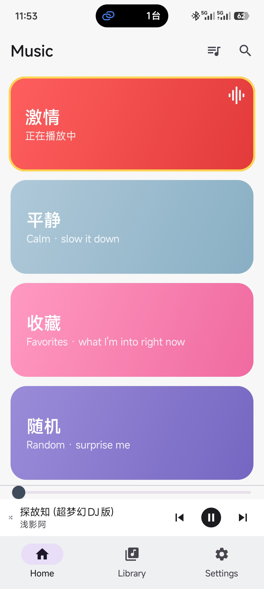
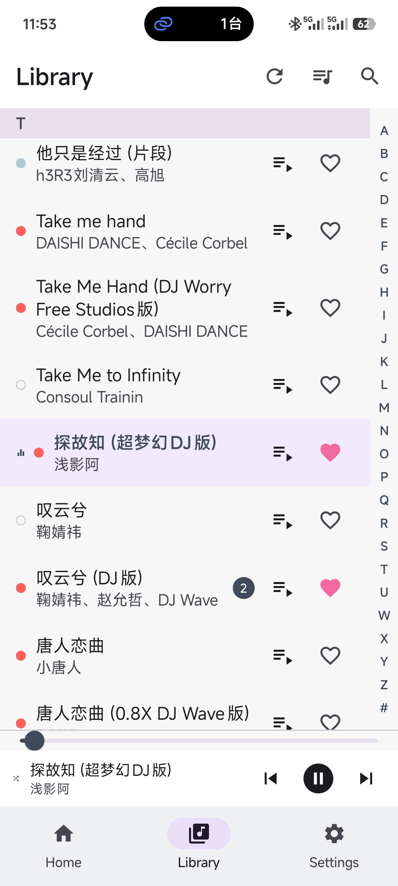
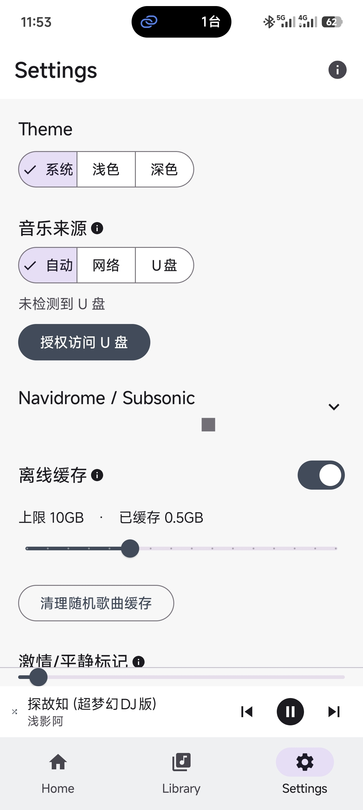

# Music

<p align="center">
  <a href="README.md">简体中文</a> | <b>English</b>
</p>

A personal Android music player, built with Kotlin + Jetpack Compose. Streams from your own [Navidrome](https://www.navidrome.org/) (Subsonic protocol) server, and falls back to reading a USB drive when you're away from the server. Home filters by "mood" — Energetic / Calm — driven entirely by a local label file, not by the song files' own tags.

This project was written end to end pair-programming with [Claude Code](https://claude.com/claude-code) — including this README and the debugging war stories below. It's open-sourced partly as an archive for myself, and partly in case you also want a player that talks to your own NAS, classifies mood reliably, and stays small — the steps below should get it running.

> Personal side project, no store listing planned, no maintenance guarantee. Issues/PRs welcome, but don't expect a fast turnaround.

<p align="center">
  
  
  
</p>

---

## Table of contents

- [What the app does](#what-the-app-does)
- [Tech stack](#tech-stack)
- [Quick start (just want an apk)](#quick-start-just-want-an-apk)
- [Backend: standing up (and optionally exposing) Navidrome](#backend-standing-up-and-optionally-exposing-navidrome)
- [Configuring the app](#configuring-the-app)
- [How mood classification works](#how-mood-classification-works)
- [Building from source](#building-from-source)
- [Project structure](#project-structure)
- [Known limitations / not done](#known-limitations--not-done)
- [Lessons learned](#lessons-learned)
- [Changelog](#changelog)
- [License](#license)

---

## What the app does

- **Dual source**: network mode talks to a Navidrome/Subsonic server; with no network or no server configured, it automatically falls back to a USB drive (grant access once via Storage Access Framework).
- **Mood-based playback**: four tiles on Home — Energetic / Calm / Favorites / Random. Energetic/Calm **don't** read the song file's own genre tag — they're driven by an independent local "label file" on the phone (keyed by title+artist; **favorites are kept in that same file**, independent of any Navidrome account). You can populate it two ways:
  - Batch-run an audio-feature analysis on your PC (`tools/`) and import the result once;
  - Or long-press a song in Library to set/clear its mood by hand, which takes effect immediately and also rolls into the next export/backup.
  - When playing Energetic/Calm, favorited songs are prioritized first.
- **Play queue**: one button in Home/Library's top bar opens it — a deliberately minimal list: title + favorite heart + remove + drag to reorder per row, "now playing" pinned at top. Manually queued "play next" songs stack in the order you tapped them (not last-tapped-plays-first).
- **Sequential/repeat-one/shuffle**: the cycle button on the mini player switches between the three; switching takes effect immediately on whatever's left in the current queue, instead of waiting for the queue to loop back around.
- **Resume playback**: reopening the app automatically resumes playing from where you left off — no extra tap on play, and no starting over from zero.
- **Offline cache**: streamed audio goes through a size-capped local LRU cache — a song you've already played doesn't need the network again, and the next couple of songs get quietly prefetched in the background.
- **Headset/Bluetooth/lock-screen** media-key integration (previous/play-pause/next) via a standard MediaSession.
- **Pinyin sort + an A–Z index strip** — Library groups by the first pinyin letter of the title, with a side strip to jump straight to a letter.
- Dark/light/follow-system theme switching.

## Tech stack

- Kotlin + Jetpack Compose (Material 3)
- [Media3 / ExoPlayer](https://developer.android.com/media/media3) for actual playback, with a hand-rolled disk cache on top
- DataStore Preferences for local persistence (server config, mood labels, playback-queue snapshot)
- A hand-written Subsonic REST API client (no third-party SDK)
- No Room/SQLite — mood labels and playback state are each just a JSON blob in DataStore; not enough data to warrant a database

## Quick start (just want an apk)

Grab the latest `Music-vX.X-debug.apk` from the [Releases](../../releases) page and install it directly on your phone (you'll need to allow "install unknown apps"). This is a **debug-signed** build, not a store-release signature — it installs and runs, that's it.

After installing, open the app and configure your Navidrome server under Settings, or plug in a USB drive (see the next two sections).

## Backend: standing up (and optionally exposing) Navidrome

The app itself doesn't store or transcode music — you need a [Navidrome](https://www.navidrome.org/) server (or any Subsonic-API-compatible server, e.g. Airsonic) pointed at a folder of actual music files. **Skip this whole section if you only plan to use USB mode.**

### 1. Stand up Navidrome with Docker Compose

On your NAS/server/always-on home machine:

```yaml
# docker-compose.yml
services:
  navidrome:
    image: deluan/navidrome:latest
    restart: unless-stopped
    ports:
      - "4533:4533"
    environment:
      ND_SCANSCHEDULE: 1h        # rescan the library for changes hourly
      ND_LOGLEVEL: info
      ND_SESSIONTIMEOUT: 24h
    volumes:
      - ./data:/data             # Navidrome's own database/config
      - /path/to/your/music:/music:ro   # point this at your actual music folder; read-only is enough
```

```bash
docker compose up -d
```

Visit `http://<your server's LAN IP>:4533` — the first time you open it, it'll have you create an admin account. **Use a real password, not a throwaway one** — this account will be able to read (not write) your entire music library going forward.

### 2. Get it working on your LAN first

With your phone and server on the same Wi-Fi, fill in `http://<LAN IP>:4533` plus your username/password under the app's Settings. If your library shows up, this step is done.

### 3. (Optional) Access it from outside your home network

**This step carries real security risk. Skipping it — using the LAN only, or auto-connecting to a VPN when you're home — is a perfectly reasonable choice.** If you do want to listen while out and about, here are a few options, roughly ordered by how safe they are:

- **Mesh-networking tools (recommended)**: [Tailscale](https://tailscale.com/) or [ZeroTier](https://www.zerotier.com/) put your phone and NAS on the same virtual LAN — install a client on your phone, then reach `http://<LAN IP>:4533` exactly like you're on your home Wi-Fi. **No router port-forwarding needed at all**, and the server stays invisible to the public internet. The lowest-hassle option for personal use.
- **Tunneling services**: things like [Cloudflare Tunnel](https://developers.cloudflare.com/cloudflare-one/connections/connect-networks/) or [frp](https://github.com/fatedier/frp) proxy the connection through a tunnel provider — also no router port to open, and you get HTTPS along the way.
- **Traditional port-forwarding + reverse proxy** (highest risk, pick carefully): forward a public port on your router to Navidrome's 4533, with Nginx/Caddy in front doing HTTPS + reverse proxy, e.g.:

  ```
  # Caddy example (automatic HTTPS)
  music.your-domain.com {
      reverse_proxy localhost:4533
  }
  ```

  If you go this route, at minimum:
  - **HTTPS is mandatory** — the Subsonic protocol's token auth doesn't send your raw password over the wire, but without HTTPS a man-in-the-middle can still grab session info;
  - use a non-default port and install [fail2ban](https://www.fail2ban.org/) against brute-forcing;
  - give Navidrome's admin account its own password, not one reused elsewhere;
  - only expose the one service you actually need — don't accidentally open your whole NAS admin panel too.

## Configuring the app

- **Settings → server URL/username/password**: fill these in as above; Library/Home will fetch the library automatically once saved.
- **Settings → music source**: Auto (USB if present, otherwise network) / force network / force USB.
- **Settings → cache**: on/off toggle + a size slider, capping the local streaming cache.
- **Settings → Energetic/Calm labels → export/import**: see the next section.

## How mood classification works

Energetic/Calm status comes from exactly **one place**: a JSON blob in the phone's local DataStore shaped like `{"title+artist": "Energetic"/"Calm"}` — not the song file's genre tag, and not any field in Navidrome's own database. This is deliberate: editing a file's tag needs a PC, but changing one song's mood from your phone should take a few seconds; and if a song file is ever genuinely replaced (retitled, or different audio dropped in under the same filename), the old label should safely fall away instead of silently attaching itself to different content.

Bulk-tagging workflow (run on whichever machine actually holds your music files; needs `pip install librosa mutagen numpy`):

```bash
# 1. Analyze audio features (slow; cached to a CSV so you can re-tune thresholds without redoing this)
python tools/classify_mood.py scan /path/to/music --cache features.csv

# 2. Dry-run first to see what it would tag; adjust --energetic-pct/--calm-pct and re-run if it looks off
python tools/classify_mood.py apply features.csv --dry-run
python tools/classify_mood.py apply features.csv

# 3. Turn the tagged genre values into the JSON format the app imports
python tools/export_mood_labels.py /path/to/music --out mood_labels.json
```

Then get `mood_labels.json` onto your phone (however you like — email, cloud drive, a chat app's file transfer) and import it via **Settings → Energetic/Calm labels → Import from file**.

Not happy with how one song got classified? No need to go back to the PC and re-run anything — just long-press it in Library and pick "Mark as Energetic / Calm / Remove classification"; it takes effect immediately and gets picked up by the next export too.

The other scripts under `tools/` (`fix_title_artist_tags.py`, `rename_title_first.py`, `fix_from_kugou_reference.py`) were one-off tools written while cleaning up a legacy mess of "title and artist swapped in the filename" — skip them if your own library's tags are already clean.

## Building from source

Needs JDK 17 and the Android SDK (`compileSdk 34` / `minSdk 26`).

```bash
git clone https://github.com/EdgeN8v/music.git
cd music
```

Open the project root in Android Studio and hit Run once Gradle syncs, or from the command line:

```bash
# Windows
.\gradlew.bat assembleDebug
# macOS/Linux
./gradlew assembleDebug
```

Output lands at `app/build/outputs/apk/debug/app-debug.apk`.

**Never installed the Android SDK before?** Easiest path is installing [Android Studio](https://developer.android.com/studio) — the first launch walks you through installing the SDK. Whatever path ends up in `local.properties`'s `sdk.dir` is fine; that file is intentionally not version-controlled (see `.gitignore`) since it's different on every machine.

## Project structure

```
app/src/main/java/com/example/music/
├── MainActivity.kt
├── data/               # SongRepository / SubsonicClient / SettingsRepository / LibraryCache …
├── playback/           # PlayerController (ExoPlayer wrapper) / AudioCache / PlaybackService (MediaSession)
├── ui/screens/         # HomeScreen / LibraryScreen / SettingsScreen
├── ui/components/      # MiniPlayerBar / QueueSheet / SongSearchOverlay / MoodTile …
├── ui/navigation/      # AppNavigation (NavHost + bottom nav)
└── util/               # PinyinUtil (pinyin sorting/indexing)

tools/                  # PC-side mood classification + tag-cleanup scripts (Python)
```

## Known limitations / not done

- No album art (the placeholder is a solid disc colored by mood category)
- The Subsonic client only hand-implements the handful of endpoints this app actually uses, not the full spec
- No automated tests
- Debug-signed, not suitable for a store listing as-is

## Lessons learned

A few not-small mistakes happened while building this, written up separately in [`docs/LESSONS_LEARNED.md`](docs/LESSONS_LEARNED.md) — including an invisible control character that broke mood-label matching across the whole library, a diagnostic tool that turned out to have its own bug halfway through the investigation, and a silent data-loss incident caused by a CoroutineScope tied to the wrong lifecycle. If you're building something similar, it might save you a step or two.

## Changelog

What changed in each version lives in [`CHANGELOG.md`](CHANGELOG.md) — the same data that's shown in Settings under the version number.

## License

[MIT](LICENSE)
